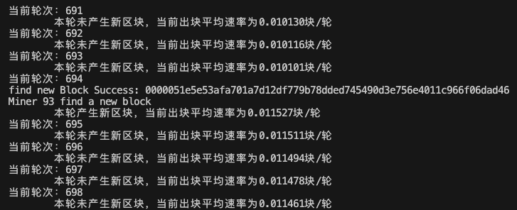
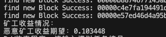
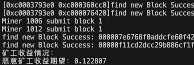
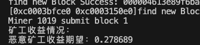
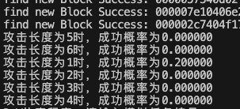
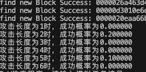
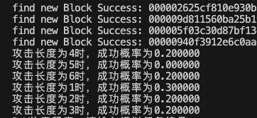
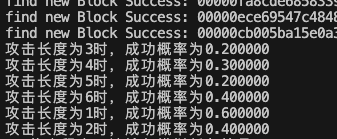

# 题目描述
使用Go实现的PoW仿真程序，模拟一定数量的节点生成区块链，并模拟一定比例的恶意节点进行分叉攻击或自私挖矿
## 参数设置
节点数量

每个轮次出块的成功率

## 测量目标
1. 测量出块速度
2. 调整恶意节点比例，并计算分叉攻击成功的长度，自私挖矿的收益比例

# 系统实现

## 1. 系统架构

以轮作为时间基本单位进行仿真，每一轮次中矿工尝试挖矿并向链提交挖到的区块。所有矿工都完成“尝试在一轮中挖矿”后，统一管理系统中新提交的区块，将他们提交到主链上。通过按轮管理，完成矿工之间的并发挖矿和时间同步。

## 2. 区块模拟
[block.go](./tools/block/block.go)中定义了区块类型，区块类型Block包含如下属性

| 属性 | 类型 | 说明 |
| ------- | ------- | ------- |
| Index | int | 区块节点索引 |
| PrevHash | [32]byte | 前一个区块的哈希值 |
| Timestamp | int64 | 区块时间戳 |
| Bits | uint64 | 难度系数，用64位无符号整型表示，用于与哈希结果前导若干位进行比较 |
| Nonce | uint64 | 随机数 |
| Tx_root | [32]byte | 模拟打包数据 Merkel Tree 根节点哈希 |

CalculateHash(b Block) 用于计算一个块的哈希

MineBlock_inOneRound(b *Block, data string, q int)以块指针b、打包数据data和本轮次挖块次数限制q作为输入，模拟一轮次挖块。如果挖块成功将返回新块指针，否则返回空指针。

## 3. 链管理
[chain.go](./tools/chain/chain.go)中定义了链的节点和整条链，以及相关的方法
链通过树状结构管理链上的节点。

链上节点类型Node包含如下属性：
| 属性 | 类型 | 说明 |
| ------- | ------- | ------- |
| SelfBlock ｜*block.Block | 节点绑定的区块的指针|
| Index | int | 区块节点索引 |
| Nextnode | []*Node | 子节点指针列表 |
| MinerID | int | 挖掘该块的矿工ID |

链类型Chain包含如下属性：
| 属性 | 类型 | 说明 |
| ------- | ------- | ------- |
| Head ｜*Node | 链首节点指针 |
| Taillist | []*Node | 链尾节点列表 |
| Unmergedlist | []*Node | 尚未合并到主链的节点指针列表 |

NewChain()创建一个只包含创始块的链并返回链指针

(c *Chain) SubmitBlock(b *block.Block, tail *Node, minerid int)接收一个区块指针b，链尾节点指针tail和矿工id minerid，对b进行校验，如果b是tail绑定区块的合法后继区块，则产生一个绑定b的Node节点并返回节点指针，否则返回空指针。

(c *Chain) GetTail()随机选取链尾节点中的某一个，并返回节点指针

(c *Chain) Merge()将当前未合并到主链的节点合并到主链，并根据PoW原则保留最长链

(c *Chain) PrintChain()打印当前的链

(c *Chain) CalBranchLength()返回链的分叉节点后的不同分支长度

(c *Chain) CalMinerReward()根据链上的区块计算矿工收益，返回矿工id-收益块数的字典

## 4. 矿工模拟
[miner.go](./tools/miner/miner.go)中定义了矿工类型，每个矿工通过MinerID作为标识。

(m Miner) MineBlock(chain *chain.Chain)接收一个链，并尝试在链上进行一轮挖矿。如果成功挖到则将产生的块提交到链的未合并列表，并返回true。否则返回false。

恶意矿工类型Vir_Miner从矿工类型Miner继承，MinerID从1000开始，并包含如下子类属性：
| 属性 | 类型 | 说明 |
| ------- | ------- | ------- |
| SelfBlocklist | []*block.Block |储存在本地未提交的区块指针数组|
| InitTarget | *chain.Node |提交本地区块时的初始节点指针|

(vm *Vir_Miner) MineBlock_SelfishAttack(chain *chain.Chain)以一个链chain作为输入，并在该链上进行自私挖矿攻击，将挖出的块储存在本地SelfBlocklist中，并将挖块开始时目标节点指针绑定在InitTarget上。如果成功挖块则返回true，否则返回block。

(vm *Vir_Miner) SubmitBlock(chain *chain.Chain)将本地存储的区块提交到chain上，并重制SelfBlocklist与InitTarget。

# 仿真示例

## 1. 测量出块速度

设置了100个节点且每轮出块概率1%（针对整个系统所有节点共同工作时的出块概率）测量示例如下：

## 2. 自私挖矿攻击

设置100个节点且每轮出块概率10%，分别测量10%，20%和30%的自私挖矿节点在挖掘100块时的收益期望

10%的恶意节点选择自私挖矿：

20%的恶意节点选择自私挖矿：

30%的恶意节点选择自私挖矿：

## 3. 测量分支攻击成功概率

设置了100个节点且每轮出块概率5%，分别测量10%，20%，30%和40%的恶意节点比例下，在长度为1--6情形下分支攻击成功的概率

10%恶意节点分支攻击

20%恶意节点分支攻击

30%恶意节点分支攻击

40%恶意节点分支攻击

